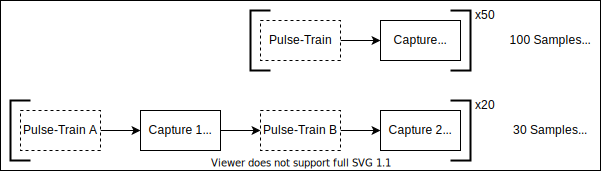

# Basic data acquisition using an ADC

The `ACQ` HAL concerns the acquisition of data-streams. It concerns instruments that act as raw analogue-to-digital converters (ADCs). Now consider the typical case where the ADC capture comes into play:

- Pulse trains are sent to the device under test (e.g. via AWGs)
- To measure the device response, a signal is sampled over many samples in the measurement window (averaging over many samples yields typically leads to better SNR and oversampling resolution).

The sequence of pulse-trains and acquisiton over the measurement window is a *Repetition*. Within one repetition window, one may wish to have multiple measurement windows to measure the response to different pulse-trains. These are termed *Segments*. Consider the diagram below to help illustrate the 3 terms:



The idea is that a given pulse train will trigger the ADC module to capture a bunch of samples (for more information on triggering read-out windows via AWG markers, see the [pulse-building article](AWG_Pulse_Building.md)). These read-outs are taken over a specified number of *Repetitions*. Multiple read-out events within a single repetition window are grouped into *Segments*. Note that the raw driver and experimental wiring will ensure that the captured segments are correctly ordered and grouped within each repetition.

To initialise an ACQ HAL (assuming that lab has is a valid Laboratory object):

```python
#Load instrument from the YAML
lab.load_instrument('digitizerCard')

...

#(A) - Initialise the ACQ HAL
ACQ("digi", lab, 'digitizerCard')

#(B) - Set the ACQ to capture 20 repetitions, 2 segments and 30 samples
lab.HAL("digi").NumRepetitions = 20
lab.HAL("digi").NumSegments = 2
lab.HAL("digi").NumSamples = 30
#Or equivalently set it via a one-liner:
lab.HAL("digi").set_acq_params(20,2,30)

#Set the sample-rate upon which to capture the individual samples within a segment:
lab.HAL("digi").SampleRate = 500e6

#(C) - Enable the first input channel, don't measure from second input channel:
lab.HAL("digi").ChannelStates = (True, False)
```

The `ACQ` HAL is called `"digi"` and the above setup is all that the user must supply. Note that some underlying drivers may raise an assertion error due to device-specific limitations on some of the above listed parameters. Now noting several features in the typical initialisation:

- (A) - As usual, the HAL is initialised by passing the unique HAL name, a `Laboratory` object and the name of the raw loaded instrument.
- (B) - The HAL properties `NumRepetitions`, `NumSegments` and `NumSamples` can be used to tinker with the acquisition properties. Note that the number of segments must be properly synchronised with the AWG pulses to ensure that the set number of segments are properly triggered for acquisition during a single repetition window.
- (C) - The channels must be given as an N-tuple boolean (`True` to enable) for an N-input ADC instrument.

As explained in [this article](Exp_Config_Basic.md), the resulting `ACQ` instrument must be passed onto the `ExperimentConfiguration` object to trigger the capture events and construct the resulting measurement dataset (grouped across repetitions, segments and samples). The resulting capture is done automatically by the engine when running the experiment with the associated experiment configuration containing the given `ACQ` HAL.
