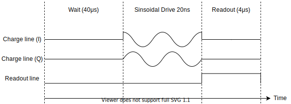
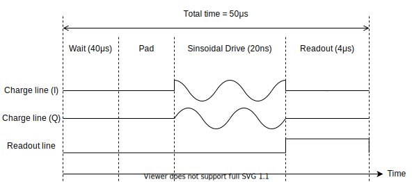
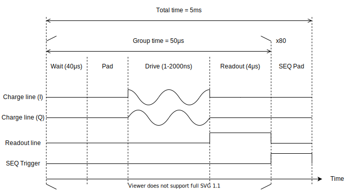
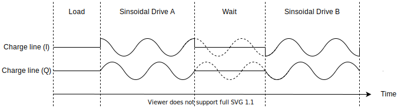

# AWG Pulse Building

The `WaveformAWG` HAL defines a waveform that is output from potentially multiple AWG outputs. The definition basic usage is highlighted on this page:

- [A simple example](#a-simple-example)
- [Flexible time-segments in waveforms of fixed time-length](#flexible-time-segments-in-waveforms-of-fixed-time-length)
- [Multiple flexible time-segments using grouping segments](#multiple-flexible-time-segments-using-grouping-segments)
- [Fancier markers](#fancier-markers)
- [Fancier waveform transformations](#fancier-waveform-transformations)

## A simple example

Consider the following timing-diagram (drawn not to scale) in which one uses two AWG channels to produce the required charge-line waveform via IQ modulation (the two IQ outputs are fed directly into an IQ mixer). In addition, a marker associated with one of the channels from the AWG is used to trigger a microwave source during readout:



The following code demonstrates a possible implementation of the above waveform (assuming that `lab` has is a valid `Laboratory` object):

```python
#Loading instruments from the YAML
lab.load_instrument('tekAWG')
lab.load_instrument('keysightAWG')

...

#(A) - Define the modulation waveform transformation
WFMT_ModulationIQ('IQmod', lab, 100e6)

#(B) - Defining the main instrument HAL for the AWG
WaveformAWG("Wfm1", lab, [('tekAWG', 'CH1'), ('keysightAWG', 'CH3')], 1e9)

#(C) - Add a basic wait
lab.HAL("Wfm1").add_waveform_segment(WFS_Constant("Wait", None, 40e-6, 0.0))
#(D) - Add a sinusoidal IQ drive 
lab.HAL("Wfm1").add_waveform_segment(WFS_Gaussian("Drive", lab.WFMT('IQmod').apply(), 20e-9, 0.1))
#Add a readout waveform (similar to the wait)
lab.HAL("Wfm1").add_waveform_segment(WFS_Constant("Read", None, 4e-6, 0.0))

#(E) - Set the second marker on the tekAWG to turn ON during the Read segment only
lab.HAL("Wfm1").get_output_channel(0).marker(1).set_markers_to_segments(["Read"])
```

The waveform HAL is uniquely named as `"Wfm1"`. The actual waveform is built by adding waveform segments. Note a common syntax for waveform segment objects (the objects with the prefix `WFS_`) all start with a name which must be unique within the waveform. The code has a few notable other features:
- (A) - A waveform-transformation, when passed onto a waveform segment, transforms the final segment waveform. In this case, the `WFMT_ModulationIQ` automatically maps the envelope waveform onto the two channels with I and Q sinusoidal waveforms.
- (B) - Defines the actual Waveform AWG HAL with the sample-rate set to 1GSPS. Note that it takes in a list of instrument and channel-name tuples. Here it forms the overall charge-line waveform using CH1 from a Tektronix AWG and CH3 from a Keysight AWG. The engine takes care of the underlying details!
- (C) - Using a `WFS_Constant` type, a basic 40μs is done by outputting zero on both channels.
- (D) - The IQ drive is done with a Gaussian envelope defined by `WFS_Gaussian`. The drive-envelope is 20ns long and 0.1V in amplitude. The application of the actual IQ modulation is given by the command `lab.WFMT("IQmod").apply()` which accesses the previously defined transformation `"IQmod"` to apply the 100MHz drive.
- (E) - The Tektronix AWG is defined to be the first channel; so index 0. The associated marker is to be the second marker; so index 1. The marker output is tied to a list of segments; in this case, just the `"Read"` segment.

Note that is all that must be done to define a waveform. To activate this particular waveform in an experiment, add the HAL object `"Wfm1"` to the list of HALs in the associated `ExperimentConfiguration` object used in a given `Experiment`. When running the experiment, **all AWG programming and sequencing is automatically done by the engine and thus, requires no further user input**. The engine will also only automatically reprogram the AWGs if the waveform has changed. This is especially useful the case where a waveform parameter is being swept in an experiment. One may define a sweeping variable in the usual manner (see notes on the `Experiment` and `Variable` classes for further details):

```python
VariableProperty("driveAmpl", lab, lab.HAL("Wfm1").get_waveform_segment("Drive"), 'Amplitude')
lab.VAR('testAmpl').Value = 0.3
```
Note that the `WFS_Gaussian` object has an `Amplitude` property that is being tied to the variable `"driveAmpl"`. Another useful property common to all waveform segment classes is `Duration`.


## Flexible time-segments in waveforms of fixed time-length

Consider the case where the waveform has a padding segment that automatically resizes its duration to satisfy a total length:



This case arises in two common cases:

- Some pulse segment's duration is going to change dynamically during the experiment via some sweeping `Variable`. A padding segment can automatically resize to ensure constant positioning of certain pulse segments.
- The AWG has particular length requirements that constrain the total length to some non-trivial value (e.g. multiples of 8 samples). The padding segment means that the other pulses can be constructed without being mindful of the total length.

To elucidate the first point, consider the case where the Drive segment in the above waveform changes in length. As the Drive duration increases, the Pad segment's duration automatically shrinks. Thus, the Readout segment always remains at the same position; an important constraint when the phase of the readout pulse with respect to the repetition window is important.

To realise the flexible padded segment, one sets the duration of at most one of the segments to -1. The engine will automatically calculate the required length to satisfy the total length.

```python
#Loading instruments from the YAML
lab.load_instrument('tekAWG')
lab.load_instrument('keysightAWG')

...

#Define the modulation waveform transformation
WFMT_ModulationIQ('IQmod', lab, 100e6)

#(A) - Defining the main instrument HAL for the AWG
WaveformAWG("Wfm1", lab, [('tekAWG', 'CH1'), ('keysightAWG', 'CH3')], 1e9, total_time=50e-6)

lab.HAL("Wfm1").add_waveform_segment(WFS_Constant("Wait", None, 40e-6, 0.0))
#(B) - Add a flexible padding segment 
lab.HAL("Wfm1").add_waveform_segment(WFS_Constant("Pad", None, -1, 0.0))
lab.HAL("Wfm1").add_waveform_segment(WFS_Gaussian("Drive", lab.WFMT('IQmod').apply(), 20e-9, 0.1))
lab.HAL("Wfm1").add_waveform_segment(WFS_Constant("Read", None, 4e-6, 0.0))

#Set the second marker on the tekAWG to turn ON during the Read segment only
lab.HAL("Wfm1").get_output_channel(0).marker(1).set_markers_to_segments(["Read"])
```

The waveform has been set up such that if the `Duration` property of the `"Drive"` segment changes, `"Read"` will still occur at exactly 46μs from the beginning. Now note the other key features:
- (A) - The `WaveformAWG` declaration now has a `total_time` given in seconds. This constrains the waveform length (in this case 50μs) and throws an exception if unsatisfied. It is usually advised to have an elastic padding segment if specifying this keyword argument.
- (B) - The waveform segment `"Pad"` has a duration of -1. Thus, its length will be automatically set by the engine to ensure that the total waveform time adds up to 50μs.

Note that since the individual AWG instruments can also set constraints on the total time (e.g. multiples of 8 samples or a minimum of 128 samples), there are utility functions to set a valid time after declaring the `WaveformAWG` object:

```python
#Get the next smallest valid total time greater than 50e-6:
valid_time = lab.HAL("Wfm1").get_valid_length_from_time(50e-6)

#Set the smallest valid total time greater than 50e-6:
lab.HAL("Wfm1").set_valid_total_time(50e-6)
```

Note that the utility functions listed above pertains to the particular AWG instrument specified and gets/sets the smallest time greater than that specified.

## Multiple flexible time-segments using grouping segments

Now in more complex experiments, one may need to perform multiple readout acquisitions in a single repetition, while still ensuring that the readout segments occur at some predetermined multiple from the beginning. In such a case, one may require multiple padded segments within grouped segments like the waveform below:



Note that in this case:
- 80 readout events are to occur over varying drive durations.
- The grouping segments are required to give each group its own padding segment that ensures that the readout always occurs at the same position within the group.
- Outside the 80 grouped segments, there is a sequence padding that ensures that the entire repetition window satisfies a particular total time. A SEQ trigger is to be ON turing this segment to help signify to the acquisition card the beginning of the repetition window (for there will be 80 readout triggers). 

The accompanying code is as follows:

```python
import numpy as np

#Loading instruments from the YAML
lab.load_instrument('tekAWG')
lab.load_instrument('keysightAWG')

...

#Define the modulation waveform transformation
WFMT_ModulationIQ('IQmod', lab, 100e6)

#Defining the main instrument HAL for the AWG (using 5ms total time)
WaveformAWG("Wfm1", lab, [('tekAWG', 'CH1'), ('keysightAWG', 'CH3')], 1e9, total_time=5e-3)

#Define 80 drive durations
drive_times = np.linspace(1e-9, 2e-6, 80)

read_segs = []
for m, cur_time in drive_times:
    #(A) - Add a grouped segment
    lab.HAL("Wfm1").add_waveform_segment(WFS_Group(f"GroupSeg{m}", [
                                        WFS_Constant("Wait",  None, 40e-6, 0.0),
                                        WFS_Constant("Pad",   None, -1, 0.0),
                                        WFS_Gaussian("Drive", lab.WFMT('IQmod').apply(), cur_time, 0.1),
                                        WFS_Gaussian("Read",  None, 4e-6, 0.0)
                                        ], time_len=50e-6))
    read_segs += [ [f"GroupSeg{m}", "Read"] ]
lab.HAL("Wfm1").add_waveform_segment(WFS_Constant("SEQ", None, -1, 0.0))

#Now read_segs looks like: [ ["GroupSeg0", "Read"], ["GroupSeg1", "Read"], ... ]

#(B) - Set the second marker on the tekAWG to turn ON during the Read segments
lab.HAL("Wfm1").get_output_channel(0).marker(1).set_markers_to_segments(read_segs)
#Set the first marker on the tekAWG to turn ON during the SEQ segment only
lab.HAL("Wfm1").get_output_channel(0).marker(0).set_markers_to_segments(["SEQ"])
```

Each `"Read"` segment occurs exactly 46μs after the beginning of each 50μs grouped window. A few features of the code include:
- (A) - The grouped segment `WFS_Group` gobbles up a list of pulse segments and accepts a group length, so that there may be one padded segment `"Pad"` with a duration of -1. Note that the names of the segments must be unique within the group (not necessarily globally unique).
- (B) - The readout marker must be ON over every `"Read"` sub-segment. Thus, to specify a segment within the group, each element in the list of segments is given as a list.

Note that the stack supports multiple groupings and sub-groupings in which the marker segments can be specified via the syntax prescribed above.

## Fancier markers

In the above example, the marker for a particular channel was set to be ON during a particular segment. However, markers can be defined to be ON over several different modes via its interface functions:

- `set_markers_to_none()` - disables markers on this marker channel
- `set_markers_to_segments([...])` - the marker is set to ON during the segments (names given as strings) in the list.
- `set_markers_to_trigger()` - marker now behaves like a single Trigger pulse. It is only in this mode that the properties `TrigPulseLength` (length of the digital pulse) and `TrigPulseDelay` (initial delay until the digital pulse) are utilised by the engine.
- `set_markers_to_arbitrary([...])` - given a list of 0s and 1s, the marker is set to be 0 or 1 during said samples. Care must be taken as the list of samples must match the number of samples in the overall waveform.

Note that the first two functions should satisfy 99% of use cases with the third function used in the odd case where the marker is just a trigger pulse that does not care about the individual waveform segments. The last function is given as a last-resort and one should first reconsider the design of the waveform segments.

Finally, the property `TrigPolarity` sets the polarity (positive: 1, negative: or 0). If negative polarity, then the output marker waveform is inverted (so ON is zero and OFF is one).

## Fancier waveform transformations

The waveform transformations are passed onto the pulse segment objects as their second argument. They can be applied with further arguments that may modify the behaviour of the given the transformation object. For example, in the case of IQ modulation, one may wish to reset the phase on a given pulse segment and have that phase continue through to the next time the same waveform transformation is applied to achieve an effect shown in the waveform below:



Notice that although the channel waveforms are zero during the Wait segment, the phase of the IQ drive continues as though it were on during said segment. The accompanying code for the segments would look as follows:

```python
WFMT_ModulationIQ('IQmod', lab, 100e6)
...
lab.HAL("Wfm1").add_waveform_segment(WFS_Constant("Load", None, 40e-6, 0.0))
lab.HAL("Wfm1").add_waveform_segment(WFS_Gaussian("Drive A", lab.WFMT('IQmod').apply(phase=0), 20e-9, 0.1))
lab.HAL("Wfm1").add_waveform_segment(WFS_Constant("Wait", None, 10e-9, 0.0))
lab.HAL("Wfm1").add_waveform_segment(WFS_Gaussian("Drive B", lab.WFMT('IQmod').apply(), 20e-9, 0.1))
```

The `WFMT_ModulationIQ` object accepts the `phase` argument. Here the phase is reset to zero in `"Drive A"`, while it is allowed to continue in `"Drive B"`. Note that one may allow it to continue while adding an extra offset by providing the `phase_offset` argument. More information on the properties of different waveform transformation objects is given [here](AWG_WFMTs.md).
