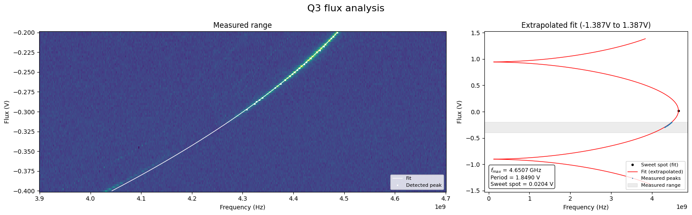

# Fitting qubit flux sweeps for frequency calibration

A calibration class `DataTransmonFlux` used for fitting data from `ExpZIQubitFluxSweep`.

## Loading and fitting data
First, a qubit spectroscopy flux sweep is performed and the data is saved.
```python
from sqdtoolz.Experiments.Experimental.ExpZIQubitFluxSweep import ExpZIQubitFluxSweep

exp = ExpZIQubitFluxSweep('Q3_flux', lab.CONFIG('ZI'), lab.HAL('QPU'), 'Q3', 
	qubit_frequencies=np.linspace(4.2e9, 4.6e9, 601), 
	res_frequencies=np.linspace(-8e6, 8e6, 51) + lab.HAL('Q3').ReadoutFrequency,  
    flux_range=np.linspace(-0.35, -0.22, 201), flux_var=lab.VAR('QfluxLine_Q3'), 
    dont_plot=True, update_qubit_params=False, print_file_path=True)
exp.run(lab)
```
A `DataTransmonFlux` class object can be instantiated with data from a file, as shown in the below snippet (where the `data_path` is replaced with the real data path). Background subtraction is performed by default, making peak detection easier.
```python
from sqdtoolz.Utilities.DataQubitFlux import DataTransmonFlux

f = DataTransmonFlux.calibrateQubitFluxFromFile('data_path')
```
The flux sweep can then be fit and plotted with the following two commands.
```python
f.fit_qubit_frequency(prominence_frac=0.99, fixed_period=1.849, 
						fit_flux_range=(-0.3, -0.2), p0=[4.7e9, 0, 0])
f.plot_qubit_flux_sweep()
```

The transmon qubit frequency as a function of the flux line voltage $f(\Phi)$ is fit by $$f(\Phi)=f_\text{max}\sqrt{\left|\cos\left(\frac{\pi(\Phi-\Phi_0)}{\text{Period}}\right)\right|}+f_\text{offset},$$where $f_\text{max}$ is the maximum qubit frequency (i.e. the frequency at the sweet spot), $\Phi_0$ is the is the flux line voltage value at the sweet spot, $\text{Period}$ is the absolute difference in flux line voltage between two consecutive sweet spots (i.e. the flux line voltage to reach the full range of transmon tuneability), and $f_\text{offset}$ is the frequency offset (from 0 Hz) at the anti-sweet spot. 

The plot produced by `f.plot_qubit_flux_sweep()` contains the qubit flux sweep data, overlaid with the fitted qubit peaks and $f(\Phi)$ fit, as well as the extrapolated fit expanded to a wider flux range.


**Input arguments**
The fitting routine `fit_qubit_frequency` can be substantially improved by supplying the function with **optional** arguments:
- `fixed_period` by directly measuring the peak-to-peak voltage from a resonator flux sweep. This sets $\text{Period}$, removing it as a fit parameter. Defaults to `None`. 
- `p0`$=[f_\text{max}, \ \phi_0, \ \text{Period}, \ f_\text{offset}]$ are the initial guesses to inform the `scipy.optimize.curve_fit` routine. Note that $\text{Period}$ is omitted from `p0` if a `fixed_period` is supplied). Defaults to `None`.

The peak-fitting routine (`scipy.signal.find_peaks`)  to determine the qubit peaks for each flux value can also be tuned by providing the **optional** input arguments:
- `prominence_frac` determines the prominence of detected peaks. If a qubit spectroscopy sweep for a certain flux does not have any peaks satisfying the condition, it is not used as a data point in the fitting routine. Defaults to `0.9`.
- `fit_flux_range` determines the $y$-axis range of the qubit flux data that should be used for fitting. All points outside this range will be ignored. This can be useful for avoiding noisy or busy areas of the spectroscopy sweep that contain other strong peaks. Defaults to `None` (i.e. the whole flux range is used).
## Class functions
Once the fit has been completed, the function $f(\Phi)$ is stored the `DataTransmonFlux` class object, which in the above examples is called `f`. We can then use `f` to query the qubit flux DC voltage (or vice-versa), or qubit flux amplitude needed to reach a frequency $f$ with the following class functions:
- `f.get_fluxDC_from_target_frequency(target_freq)`: returns the flux DC value required to tune the qubit to $f=$`target_freq`. By default, this function returns a negative flux value closest to 0 V for the given frequency.
- `f.get_frequency_from_fluxDC(fluxDC)`: returns the fitted qubit frequency for a given flux line voltage `fluxDC`.
- `f.get_frequency_from_fluxAmplitude(flux_amplitude, fluxDC=0)`: Returns the fitted qubit frequency when a flux pulse of amplitude `flux_amplitude` is applied on top of a DC bias point `fluxDC` (i.e. $\text{total flux = fluxDC\_bias + flux\_amplitude}$). This can be used, for example, to convert the $x$-axis of a flux-pulsed chevron plot from flux amplitude values to frequency. 

