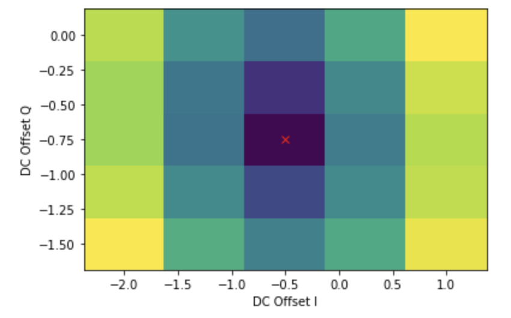

# Automated experiments

The results from an experiment are typically post-processed (e.g. fitting a Rabi experiment to a sinusoidal decay to extract the Rabi frequency). Although this can be done manually in the experiment scripts, a cleaner approach a repetitive experiment is to:

- Override the `Experiment` class' functions to write a custom experiment that has a well-tested post-processing sub-routine
- The post-processing should also automatically set the values of desired parameters (whether it is a VAR or a SPEC) based on the results of the given experiment (e.g. setting the cavity resonance frequency or the Rabi frequency)

Details of writing custom `Experiment` classes are given in the developer documentation. This page will give a usage summary of the currently written classes.

## Rabi experiment (ExpRabi)

TBW

## Mixer Calibration

### Set up
In the typical experimental set-up, an IQ mixer takes a local oscillator signal at $\omega_{LO}$ and mixes it with two intermediate frequency $\omega_{IF}$ pulse envelopes. These envelopes have a $\pi/2$ phase shift relative to each other. We typically use $\omega_{LO} = \omega_q + 100$ MHz, and $\omega_{IF} = 100$ MHz. With these inputs, the mixer will produce a signal with sidebands at $\omega_{q}$ and $\omega_{q} + 200$ MHz, plus some component of the original LO signal at $\omega_q + 100$ MHz. 

To implement this, connect two channels of an AWG to the I and Q ports of an IQ mixer. Then, route a microwave source to the LO port at $\omega_q + 100$ MHz. The mixed output will be yielded at the RF port. In pulsed control, this is routed to the appropriate drive line. For mixer calibration, instead route this output to the downconversion chain, where it can be acquired and measured. We are aiming to see three peaks, and subsequently suppress the two we do not want by 'mixer calibration'.

To see the three peaks, you can then simply run an experiment where you sweep the measurement downconversion signal from (-200 MHz) to (+200 MHz) around $\omega_q + 25$ MHz. The peaks will appear at -100 MHz, 0 MHz, and 100 MHz. This is the sanity check experiment.

Mixer calibration seeks to suppress the leakage of the original LO signal and the upper sideband (or lower). The first experiment is for suppressing leakage.

### LO Mixer calibration (ExpMixerCalibrationLO)

Optimal suppression of the central leakage tone  is achieved by applying DC offset at the IF ports of the mixer. Some AWGs have capacity to add this to the pulse envelopes themselves, some require an external voltage source added to the appropriate port via bias tee. Once implemented, `ExpMixerCalibrationLO` provides an automated experiment to calibrate these voltage offsets.  Arguments are:

- `name`: experiment name, for save dir
- `expt_config`: instrument config
- `var_down_conv_freq`: An `sqdtoolz Variable` which is typically 25 MHz, used to downconvert the mixed signal for acquisition
- `LO_frequency`: The expected frequency peaks for LCR (Left sideband, Centre, Right sideband). This should be a list of floats.
- `var_DC_off_I`: The `sqdtoolz Variable` which controls the DC offset on the I-port of the mixer.
- `range_DC_off_I`: The range over which to search for an optimal offset voltage (typically, something like (-2,2) is a good place to start.)
- `var_DC_off_Q`, `range_DC_off_Q`: Analogous to the above

example:
```python
lab.HAL('DCoff_I').RampRate = 1.0
lab.HAL('DCoff_Q').RampRate = 1.0
stz.VariableProperty('DCoff_I', lab, lab.HAL('DCoff_I'), 'Voltage')
stz.VariableProperty('DCoff_Q', lab, lab.HAL('DCoff_Q'), 'Voltage')

stz.VariableInternal('freq_mixer_calib', lab)
stz.VariableSpaced('qubit_freq_mixer_calib', lab, 'freq_mixer_calib', 'MWDownConv', -25e6)

new_exp = ExpMixerCalibrationLO('mixer_calib_LO', lab.CONFIG('mixer_calib'), lab.VAR('qubit_freq_mixer_calib'), lab.SPEC(f'Qubit0')['Frequency GE'].Value ,lab.VAR('DCoff_I'), (-2.0,1), lab.VAR('DCoff_Q'), (-1.5,0))

leData = lab.run_single(new_exp)
```

Running this experiment with the above arguments will produce a square grid in your selected range, representing the leakage of the central signal with respect to offset voltages. You want to minimise this. To do this, toy with the range for DC_off_I and DC_off_Q until there is a clear bowl-shaped minimum, like:


Now, you can run the experiment again within a reasonable range defined by eye, providing some additional arguments which will autonomously optimise the I and Q offsets. 
To do this, include:
- `optimise = True`, a True/False flag to signal the optimisation process
- `sample_points`, an integer (typically 4) which defines the number of points to sample per iteration in optimisation
- `iterations`, an integer (typically 6+) which is the number of iterations the optimisation will use
- `win_shrink_factor`, a float (typically ~0.33) which shrinks the optimisation window by that factor in each iteration

Once optimal offsets are found, save them (recommended to save in an ExperimentSpecification object) and set them, and perform the sanity test experiment from set-up to see if the central peak has been suppressed.

It is not so important, but the autonomous algorithm roughly does the following:
- Samples a series of candidates for $V_I$ within your given I bounds, at the midpoint of your given Q bounds $\tilde{V}_Q$. 
- Fits the samples to a parabola.
- Shrinks the $I$ bounds of the search to a fraction of the size, centred around the minimum of the fitted parabola.
- Samples a series of candidates for $V_Q$, around the new midpoint $\tilde{V}_I$.
- Fits the samples to a parabola.
- Shrinks the $Q$ bounds of the search to a fraction of the size, centred around the minimum of the fitted parabola.
- And so on, until iterations are complete.

### SB Mixer Calibration (ExpMixerCalibrationSB)

A selected sideband can then be suppressed by tuning the relative amplitude and phase of the I and Q pulse envelopes. The relative amplitude refers to a scaling I/Q on the pulse amplitudes, so the default is 1. The relative phase refers to a phase shift between the I and Q signals; the default in this experiment is 0, which corresponds to a pi/2 phase shift.

To create `Variable` objects for these attributes, use:
``` 
sqdtoolz.VariableProperty('IQ_amp_fac', lab, lab.WFMT('your_wfmt_here'), 'IQAmplitudeFactor')

sqdtoolz.VariableProperty('IQ_phs_diff', lab, lab.WFMT('your_wfmt_here'), 'IQPhaseOffset')
```

Then, the relevant arguments are:

- `name`: experiment name, for save dir
- `expt_config`: instrument config
- `var_down_conv_freq`: An `sqdtoolz Variable` which is typically 25 MHz, used to downconvert the mixed signal for acquisition
- `freq_SB_minimise`: The frequency of the sideband to minimise, typically $\omega_q + 100$ MHz.
- `var_amp`: The `sqdtoolz Variable` which controls the relative I/Q amplitude.
- `range_amps`: The range over which to search for an optimal relative amplitude (typically, something like (0.8,1.2) is a good place to start.)
- `var_phs`, `range_phs`: Analogous to the above

This should produce a square grid which looks similar to that of the LO experiment. If not, it is generally useful to play with the starting phase conditions, until you find a bowl-shaped minimum.

The exact same arguments can then be used to trigger autonomous optimisation, once a range which encompasses a bowl-shaped minimum is found. The relative amplitude factor and phase offset should then be saved accordingly. Again, perform the sanity check experiment to see if only one peak (e.g. the lower sideband) remains.

