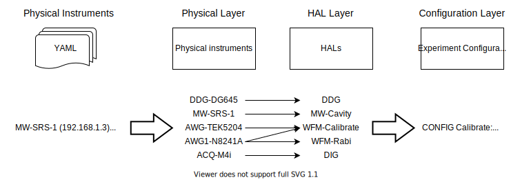
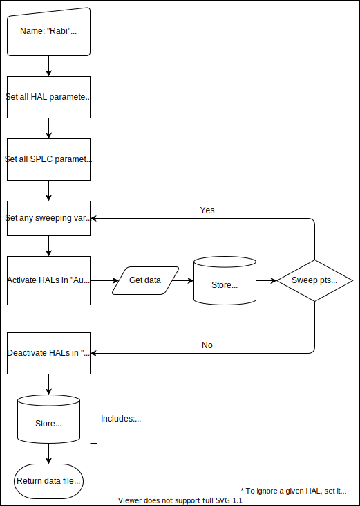

# Overview of general workflow

## Setup

The general flow for the setup is highlighted below:



The individual components involve:
- Physical instruments:
    - These are the individual instruments and fixed parameters (e.g. its communication IP address, the input trigger port, the frequency of the Rb oven to which it is connected etc.)
    - YAML file holds all low-level physical instrument parameters (using the [QCoDeS format](https://qcodes.github.io/Qcodes/examples/Station.html))
- Physical layer:
    - Not all instruments listed in the YAML will be used in a given experimental setup/run - e.g. the YAML may contain instruments across mutliple racks to keep a static record of IPs...
    - All instruments that are to be used in this experimental run (instruments on the designated rack) are loaded via the `load_instrument` function
- HAL (hardware abstraction layer):
    - A HAL gobbles up the physical instrument object along with other parameters. They are used in the next layer when handling instruments.
    - The individual instruments are handled in a universal manner (that is, the same set of properties to get/set for a given instrument type regardless of the physical instrument at hand)
- Experiment-Configuration layer:
    - `ExperimentConfiguration` objects record the settings on the individual HAL objects and collate the trigger relationships for the subsequent timing diagram
    - Different routines/experiments (e.g. cavity sweep, Rabi experiment etc.) utilise different `ExperimentConfiguration` objects
    - Note that different experiments can still utilise the same `ExperimentConfiguration` object. For example, a cavity and qubit spectral sweep may utilise the same settings on the different instruments while simply sweeping different frequencies. Another example, is using waveform mappers to share configurations across automated experiments (e.g. Rabi, Ramsey etc.)

Note that all layers and transactions are done via the single `Laboratory` object associated with the given experiment run. The `Laboratory` object stores and handles the individual physical layer instruments, HALs and Experiment-Configurations. With the setup code settled, one may run experiments.

## Run

Experiments can be run via (assuming a `Laboratory` object called `lab`):

``` python
#Create experiment object (it's temporary and not stored in lab)
exp = Experiment("Rabi", lab.CONFIG('AutoExp'))
#Run experiment without sweeping parameters:
result = lab.run_single(exp)
#Run experiment with sweeping parameters:
result = lab.run_single(exp, [(lab.VAR("wait_time"), np.arange(0,100e-9,10e-9))])
```

The result on running the experiment is a file created with the time-stamp and the prescribed experiment name. It will have the data stored in a HDF5 file with the returned result being a `FileIOReader` object to said file. Internally, the following set of subroutines are performed by the engine:



The mechanics of sweeping, running cascaded experiments (to put grouped experiments into a single folder) and pre-written automatic experiments are highlighted in the next [document](Exp_Sweep.md). In addition, the ability to record the value of arbitrary parameters over the course of the experiment (via the `rec_params` argument) is discussed in another [document](Exp_RecParams.md). Now, in general, note that:

- Instrument preparation is taken to match the HAL parameters that were present when creating the `ExperimentConfiguration` object
- The AWGs are automatically programmed only if necessary. For example, if the subsequent sweeping iterations do not change the waveform, then the AWG will not be unnecessarily reprogrammed.
- The SPEC parameters are set **after** the engine first sets all instrument HAL parameters. Thus, any settings in the `ExperimentSpecification` objects will overwrite linked HAL parameters.
- The `LaboratoryConfiguration.txt` file stores the HAL parameters right in the end; so the instrument settings will correspond to the final sweeping point.
- Most experiments store the points dynamically on finishing a given sweeping point. As its done in SWMR mode, one may view/analyse the data with realtime live-plotting tools such as [SQDViz](https://github.com/sqdlab/SQDViz).

Note that the `Experiment` object holds some `FileIOReader` objects (that is, handles to the created data files) for easy querying/access. To release all of these handles (e.g. when trying to delete the files etc.), run:

```python
exp.close_all_read_files()
```
