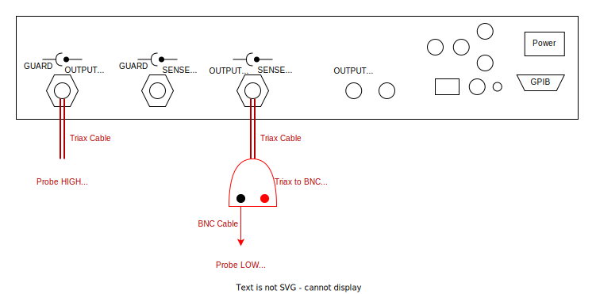
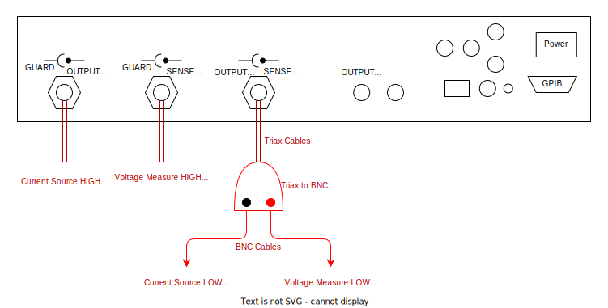

# Keithley 236 (Driver: SMU_Keithley236)

The Keithley 236 SMU can:
- Perform basic SMU functions with up to 240V source voltages
- Perform fast-sweeping to produce quick IV-curves in either 2 or 4 probe modes

Currently the driver is written so that it talks via the unit's GPIB port using the Prologix GBIB/Ethernet converter.

The unit can be setup in two modes:
- [Source voltage/current, measure current/voltage in 2-probe mode](#2-wire-mode)
- [Source current and measure voltage in 4-probe mode](#4-wire-mode)

## 2-wire mode

YAML entry:

```yaml
  smu:
    type: sqdtoolz.Drivers.SMU_Keithley236.SMU_Keithley236
    address: '192.168.0.200'
    init:
      gpib_slot: 19
    enable_forced_reconnect: true
```

Just set the appropriate Prologix IP address and the GPIB port number. The rear panel should be connected as follows:



The two probe pins (HIGH and LOW) can be used in a 2-Wire configuration.

## 4-wire mode

YAML entry:

```yaml
  smu:
    type: sqdtoolz.Drivers.SMU_Keithley236.SMU_Keithley236
    address: '192.168.0.200'
    init:
      gpib_slot: 19
    enable_forced_reconnect: true
```

Just set the appropriate Prologix IP address and the GPIB port number. The rear panel should be connected as follows:



The 4-probe connections provide the current source and voltage measure probes. Note that the **driver currently only supports source current, measure voltage mode for 4-probe measurements**.
