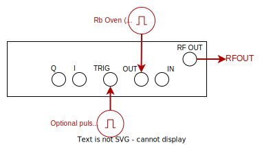
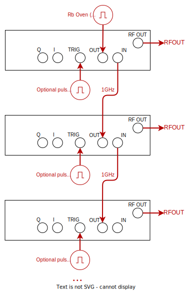

# Rohde & Schwarz SGS100A (Driver: MWS_SGS100A)

The SGS100A has:
- One output RF channel covering: 1MHz to 12.75GHz
- Can pulse modulate the output via an input digital signal - this instrument does not support other types of modulation.
- Multiple instruments can be daisy-chained for optimal phase-coherence

## Single independent source

YAML entry:

```yaml
  src_sgs1:
    driver: sqdtoolz.Drivers.MWS_SGS100A
    type: MWS_SGS100A
    address: TCPIP::192.168.1.115::INSTR
    enable_forced_reconnect: true
    parameters:
      ref_osc_source:
        initial_value: 'EXT' #Can be INT or EXT
      ref_osc_external_freq:
        initial_value: '10MHz'  #Can be '10MHz', '100MHz', '1000MHz'
      trigger_impedance:
        initial_value: 'G10K'   #Important when using low-amplitude/weakly-driven trigger pulses
      alc:
        initial_value: 'OFF'  #Can be ON, OFF, AUTO
      #Output Channel Parameters
      RFOUT.output:
        initial_value: 'OFF'
```

Just set the IP address correctly. The microwave source should be wired up as follows (showing rear panel):



Note the following:

- The modulation settings can be enabled via the [HAL](../GENmwSource.md).
- Set the trigger input (if using pulse modulation) to TTL levels.

## Daisy-chain multiple instruments

YAML entry:

```yaml
  src_sgs1:
    driver: sqdtoolz.Drivers.MWS_SGS100A
    type: MWS_SGS100A
    address: TCPIP::192.168.1.119::INSTR
    enable_forced_reconnect: true
    parameters:
      ref_osc_source:
        initial_value: 'EXT' #Can be INT or EXT
      ref_osc_external_freq:
        initial_value: '10MHz'  #Can be '10MHz', '100MHz', '1000MHz'
      ref_osc_output_freq:
        initial_value: '1000MHz'  #Can be '10MHz', '100MHz', '1000MHz'
      alc:
        initial_value: 'OFF'  #Can be ON, OFF, AUTO
      trigger_impedance:
        initial_value: 'G10K' #Important when using low-amplitude/weakly-driven trigger pulses
      #Output Channel Parameters
      RFOUT.output:
        initial_value: 'OFF'
  src_sgs2:
    driver: sqdtoolz.Drivers.MWS_SGS100A
    type: MWS_SGS100A
    address: TCPIP::192.168.1.8::INSTR
    enable_forced_reconnect: true
    parameters:
      ref_osc_source:
        initial_value: 'EXT' #Can be INT or EXT
      ref_osc_output_freq:
        initial_value: '1000MHz'  #Can be '10MHz', '100MHz', '1000MHz'
      ref_osc_external_freq:
        initial_value: '1000MHz'  #Can be '10MHz', '100MHz', '1000MHz'
      alc:
        initial_value: 'OFF'  #Can be ON, OFF, AUTO
      trigger_impedance:
        initial_value: 'G10K' #Important when using low-amplitude/weakly-driven trigger pulses
      #Output Channel Parameters
      RFOUT.output:
        initial_value: 'OFF'
  src_sgs3:
    driver: sqdtoolz.Drivers.MWS_SGS100A
    type: MWS_SGS100A
    address: TCPIP::192.168.1.8::INSTR
    enable_forced_reconnect: true
    parameters:
      ref_osc_source:
        initial_value: 'EXT' #Can be INT or EXT
      ref_osc_output_freq:
        initial_value: '1000MHz'  #Can be '10MHz', '100MHz', '1000MHz'
      ref_osc_external_freq:
        initial_value: '1000MHz'  #Can be '10MHz', '100MHz', '1000MHz'
      alc:
        initial_value: 'OFF'  #Can be ON, OFF, AUTO
      trigger_impedance:
        initial_value: 'G10K' #Important when using low-amplitude/weakly-driven trigger pulses
      #Output Channel Parameters
      RFOUT.output:
        initial_value: 'OFF'
```

Just set the IP address correctly. Notice that the key difference is that the first source gets fed a 10MHz RB oven source and outputs 1GHz. The remaining sources synchronise via `'1000MHz'` signals. The microwave source should be wired up as follows (showing rear panels):




Note the following:

- The modulation settings can be enabled via the [HAL](../GENmwSource.md).
- Set the trigger input (if using pulse modulation) to TTL levels.
- Make sure that the daisy-chain mirrors the hardware wiring; if incorrectly configured, the front light *REF EXT* will be red instead of green.
