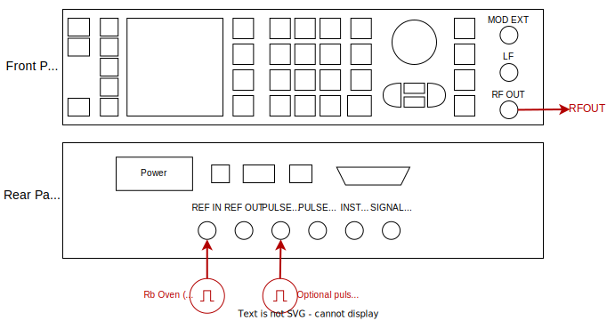

# Rohde & Schwarz SMB100A (Driver: MWS_SMB100A)

The SMB100A has:
- One output RF channel covering:  100 kHz to 12.75GHz
- Support for amplitude, frequency and phase modulation via an input analogue signal
- Support for pulse modulation via an input digital signal

The unit is typically operated in:
- [Continuous output with optional digital pulse modulation](#digital-pulse-modulation)
- [Continuous output with amplitude/frequency/phase modulation](#analogue-pulse-modulation)


## Digital pulse modulation

YAML entry:

```yaml
  src_smb:
    driver: sqdtoolz.Drivers.MWS_SMB100A
    type: MWS_SMB100A
    address: TCPIP::192.168.1.111::INSTR
    enable_forced_reconnect: true
    parameters:
      ref_osc_source:
        initial_value: 'EXT' #Can be INT or EXT
      ref_osc_external_freq:
        initial_value: '10MHz'
      alc:
        initial_value: 'OFF'  #Can be ON, OFF, AUTO
      #Output Channel Parameters
      RFOUT.output:
        initial_value: 'OFF'
      RFOUT.frequency:
        initial_value: 1.25e9
      RFOUT.phase:
        initial_value: 0.0
      RFOUT.power:
        initial_value: 0
      RFOUT.pulsemod_source:
        initial_value: 'EXT'
```

Just set the IP address correctly. The microwave source should be wired up as follows:



Note the following:

- The modulation settings can be enabled via the [HAL](../GENmwSource.md).
- The pulse modulation input is in the back

## Analogue pulse modulation

YAML entry:

```yaml
  src_smb:
    driver: sqdtoolz.Drivers.MWS_SMB100A
    type: MWS_SMB100A
    address: TCPIP::192.168.1.111::INSTR
    enable_forced_reconnect: true
    parameters:
      ref_osc_source:
        initial_value: 'EXT' #Can be INT or EXT
      ref_osc_external_freq:
        initial_value: '10MHz'
      alc:
        initial_value: 'OFF'  #Can be ON, OFF, AUTO
      #Output Channel Parameters
      RFOUT.output:
        initial_value: 'OFF'
      RFOUT.frequency:
        initial_value: 1.25e9
      RFOUT.phase:
        initial_value: 0.0
      RFOUT.power:
        initial_value: 0
      RFOUT.amplmod_source:
        initial_value: 'EXT'
      RFOUT.freqmod_source:
        initial_value: 'EXT'
      RFOUT.phasemod_source:
        initial_value: 'EXT'
```

Just set the IP address correctly. Make sure to set the the intended analogue modulation source to `'EXT'`. The microwave source should be wired up as follows:


Note the following:

- The modulation settings can be enabled via the [HAL](../GENmwSource.md).
- The modulation for AM, FM or PM is on the front panel.
