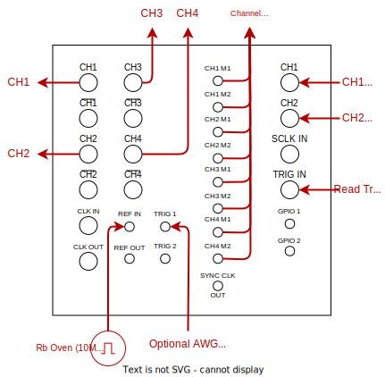
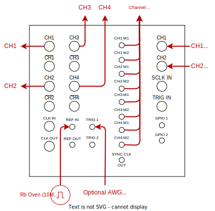

# Tabor P2584M

The Tabor PXI module has:

- 4 AWG outputs capable up to 2GSPS, each with 2 markers
- 2 ADC inputs capable up to 2.7GSPS

The module comes with its own DSP blocks that can be used for onboard processing and feedback. Specifically for each channel, the DSP pipeline (accessed via the [Processor_FPGA API](../Proc_FPGA_Overview.md)) follows:

- Up to 5 parallel multiplication blocks on each channel or up to 10 on CH1 if disabling CH2. These can be used for multitone demodulation via `FPGA_DDC` and with integrated filtering via `FPGA_DDCFIR`.
- Mandatory 10x decimation block that must be included via `FPGA_Decimation`.
- Optional `'sample'` and/or `'repetition'` integration blocks accessed via `FPGA_Integrate`.


## Initial setup notes

The PXI module slots into the main PXI chassis and connects to the PC via the backplane cable. Note the following:

- The PXI chassis must be (re)started first **before** (re)booting the PC.
- The PXI module apparently overheats and causes glitches. So put the fans on the back to maximum.
- Ensure that via Tabor's programming tool, that the Tabor firmware is on the latest stable firmware.

The Tabor P2584M has both an `'AWG'` and `'ACQ'` submodules that can be accessed via (assuming `Laboratory` object `lab`):

```python
lab.load_instrument('TaborUnit')    #As specified in the YAML
...
WaveformAWG("Waveform", lab,  [(['TaborAWG', 'AWG'], 'CH1'), (['TaborAWG', 'AWG'], 'CH2')], 2.0e9, 40e-6)
...
ACQ("TaborACQ", lab, ['TaborAWG', 'ACQ'])
```

## Acquire via External Triggers

YAML entry:

```yaml
  TaborUnit:
    driver: sqdtoolz.Drivers.Tabor_P2584M
    type: Tabor_P2584M
    init:
      pxi_chassis: 0
      pxi_slot: 3
    parameters:
      AWG.CH1.trig_src:
        initial_value: 'NONE'   #'TRG1' if it is to be triggered externally
      AWG.CH2.trig_src:
        initial_value: 'NONE'   #'TRG1' if it is to be triggered externally
```

Just make sure that the PXI chassis and slot IDs are correct. This can be checked via Tabor's *WDS Studio* application or their programming tool. In addition, change the appropriate options if the AWG portion of the module is to be triggered externally. The module should be wired up as follows:



Regarding the AWG side on the left, note the following:

- Each channel can be on continuous internal triggering `'NONE'` whereupon it repeats or on external triggering `'TRG1'` where the waveform plays once upon receiving a trigger.
- Each channel has 2 markers that are zero-index enumerated as usual in [`WaveformAWG`](../AWG_Pulse_Building.md) as 0 and 1.

Regarding the ACQ side on the right, note the following:

- The *Read Trigger* refers to the clock pulse that starts off a repetition (or segment within a repetition) as explained in the [ACQ HAL article](../ACQ.md).
- The *Read Trigger* will trigger both input channels at once if chosen to acquire.
- If the internal markers (outlined in the next section) have not been specified, the ACQ module will be set to external triggering.

This setup is sufficient for most cases and should remain phase-coherent even if connecting a channel marker to the *Read Trigger*.


## Acquire via Internal Triggers

YAML entry:

```yaml
  TaborUnit:
    driver: sqdtoolz.Drivers.Tabor_P2584M
    type: Tabor_P2584M
    init:
      pxi_chassis: 0
      pxi_slot: 3
    parameters:
      AWG.CH1.trig_src:
        initial_value: 'NONE'   #'TRG1' if it is to be triggered externally
      AWG.CH2.trig_src:
        initial_value: 'NONE'   #'TRG1' if it is to be triggered externally
```

Just make sure that the PXI chassis and slot IDs are correct. This can be checked via Tabor's *WDS Studio* application or their programming tool. In addition, change the appropriate options if the AWG portion of the module is to be triggered externally. The module should be wired up as follows:



Regarding the AWG side on the left, note the following:

- Each channel can be on continuous internal triggering `'NONE'` whereupon it repeats or on external triggering `'TRG1'` where the waveform plays once upon receiving a trigger.
- Each channel has **3 markers** that are zero-index enumerated as usual in [`WaveformAWG`](../AWG_Pulse_Building.md). **The physical ports are on indices: 0 and 1. The internal trigger connected to the ACQ side is on index 2.**

Regarding the ACQ side on the right, note the following:

- The acquisition trigger is connected internally if any of the `WaveformAWG` channels have a marker on index 2. This marker is the clock pulse that starts off a repetition (or segment within a repetition) as explained in the [ACQ HAL article](../ACQ.md).
- The internal acquisition trigger will trigger both input channels at once if chosen to acquire.

This setup will ensure phase coherence between the AWG and ACQ sides. Note that the **AWG sample rate must be 80% the ACQ sample rate when using internal trigger**.

## Using the DSP blocks

Upon setting up the AWG and ACQ blocks, one may run the DSP blocks to perform onboard processing. There are several constraints that must be met (or an assertion error will be fired):

- `NumSamples` must be less than or equal to 10240
- `NumSamples` must be divisible by 360 (note the mandatory 10x decimation)
- Must activate both channels if using the internal DSP - even if the second channel is not acquired (e.g. selecting demodulations only on one of the channels).
- AWG sample rate must be 80% the ACQ sample rate when using internal triggering.

The DSP blocks will automatically configure during an experiment when passing an `Processor_FPGA` processor onto the Tabor `ACQ` object.
