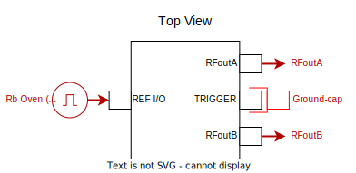

# Windfreak SynthHD PRO (v2) (Driver: MWS_WFSynthHDProV2)

The [Windfreak SynthHD PRO (v2)](https://windfreaktech.com/product/microwave-signal-generator-synthhd-pro/) has:
- Two output RF channels covering:  10 MHz to 24GHz
- Supports modulation, but it appears to be software-based; it is recommended to just ground-gap the Trigger input.

## Continuous mode

YAML entry:

```yaml
  MWS_Windfreak:
    type: sqdtoolz.Drivers.MWS_WFSynthHDProV2.MWS_WFSynthHDProV2
    address: 'COM3'
    enable_forced_reconnect: true
    parameters:
      EXT_REF_frequency:
        initial_value: 10e6
      RFoutA.REF_Source:
        initial_value: 'EXT'
      RFoutB.REF_Source:
        initial_value: 'EXT'
```

Just set the COM port `address` correctly. The microwave source should be wired up as follows (connecting it to a 5V power supply via the barrel jack and a PC via the USB-C port):



Note the following:

- The Rb clock is mandatory to ensure a clean output
- The two outputs may operate independently via two separate instances of the [HAL](../GENmwSource.md).

## Modulation

Modulation mode is not recommended - keep it in `'Continuous'` mode.
