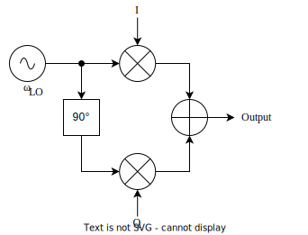
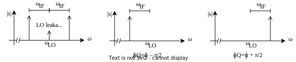

# IQ modulation

The qubit charge line requires a sine wave with frequency $\omega_q$ that can be turned on/off with some envelope (typically Gaussian). Since this frequency can range in the several gigahertz, it is beyond the sampling output capabilities of typical AWGs which usually are limited to 1.2-2GSPS (that is, at most a 600-1000MHz output frequency). Thus, an upconversion setup is required where the low frequency signal $\omega_{\tiny{IF}}$ is multiplied by a higher LO (local-oscillator) signal $\omega_{\tiny{LO}}$. However, this will produce two sidebands (from the product to sums trigonometric identity) $\omega_{LO}\pm\omega_{\tiny{IF}}$. IQ modulation aims to eliminate the sideband via clever choice of amplitudes and phases.

Consider the following setup:

The multipliers and the 90° phase delay is usually embedded within an IQ-mixer. The idea is that **two AWG signals are required** for the I and Q inputs:

$$
\begin{align*}
I(t) &= {\color{gray}{I_{dc}}}+I_0\cos(\omega_{\tiny{IF}}t+\phi)\\
Q(t) &= {\color{gray}{Q_{dc}}}+Q_0\cos(\omega_{\tiny{IF}}t+\phi_Q)
\end{align*}
$$

The DC offsets $I_{dc}$ and $Q_{dc}$ are present in the AWG and/or the mixer. One must choose the amplitudes $I_0$, $Q_0$ along with the phase-offsets $\phi$ and $\phi_Q$ to produce the desired final frequency. Now consider the final mixer output:

$$
s(t)=I(t)\cdot\cos(\omega_{\tiny{LO}}t)+Q(t)\cdot\sin(\omega_{\tiny{LO}}t)
$$

By taking: $\phi_Q=\phi\pm\pi/2$ and $I_0=Q_0=A$:

$$
s(t)=A\cos((\omega_{\tiny{LO}}\pm\omega_{\tiny{IF}})t\pm\phi)+{\color{gray}{I_{dc}}\cos(\omega_{\tiny{LO}}t)}+{\color{gray}{Q_{dc}}\sin(\omega_{\tiny{LO}}t)}.
$$

That is, by appropriately balancing the phases and amplitudes, the final signal only has a single sideband. Similarly one must appropriately zero the DC offsets $I_{dc}$ and $Q_{dc}$ to eliminate the remaining terms due to LO-leakage.

