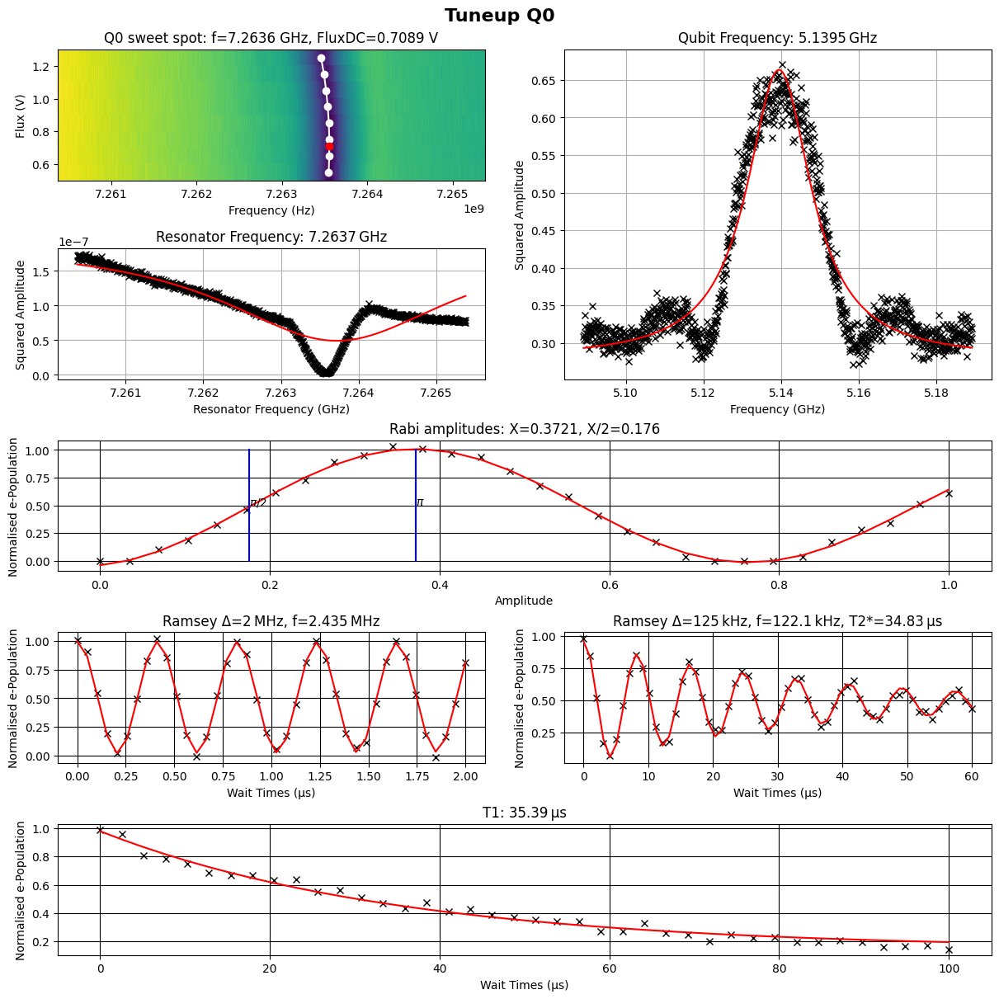

# Semi-automated single qubit tuneup with ZI

`ExpZISingleQubitTuneup` is used for semi-automated tuneup of a transmon qubit. It contains routine measurements to find the flux sweet spot, calibrate Rabi pulses, fine-tune the qubit frequency, and characterise the qubit $T_1$ and $T_2^*$. The user should first identify the optimal frequencies of both the readout resonator (`ExpZIRes`) and the qubit (`ExpZIQubitSpec`), and the optimal readout power (`ExpZIResPowerSweep`). The user should also set `lab.HAL('Q0').ResetTime` to be at least 5 times greater than the expected $T_1$, and `lab.HAL('Q0').DriveGETime` to be reaonable (see ). Once these attributes have been set to the qubit (e.g. `lab.HAL('Q0').ReadoutFrequency = 6.1e9`), `ExpZISingleQubitTuneup` should take care of the rest. Averaging parameters (i.e. `lab.HAL('ZIacq').NumRepetitions = 1024`) should also be set by the user to allow for sufficient SNR. 

Default parameters for `ExpZISingleQubitTuneup` have been set so that the existing qubit parameters are used to choose suitable frequency ranges for spectroscopy experiments, and drive/readout powers for time domain experiments (Rabi, Ramsey, lifetime etc.). However, the user has access to all measurement parameters as keyword arguments when initialising the `ExpZISingleQubitTuneup` class.

The measurement sequence and attributes set by each measurement in `ExpZISingleQubitTuneup` (as well as the corresponding optional input arguments) is as follows:
1. **Resonator flux sweep:** sweeps the flux according to `flux_range`, which is the only required argument for measurement parameters. If no `flux_range` is given, the resonator flux sweep is skipped. Sets `FluxDC` to the sweetspot.
    - `flux_range`: Array of voltages to sweep over in the resonator flux sweep, e.g. `flux_range=np.arange(1.25, 0.5, -0.1)`. Defaults to `None`.
    - `res_freq_range`:  Array of frequencies for resonator spectroscopy, e.g. `res_freq_range=np.linspace(7.2e9, 7.3e9, 1001)`. Defaults to an array of 1001 points, with a 10 MHz span around the `ReadoutFrequency` currently set to the qubit (i.e. `lab.HAL('Q0').ReadoutFrequency`).
    - `res_freq_span`: Float value to define the span (can only be provided as an alternative to `res_freq_range`). Defaults to `10e6`.
    - `res_freq_points`: Number of frequency points (can only be provided as an alternative to `res_freq_range`). Defaults to `1001`.
2. **Resonator spectroscopy:** Resonator spectroscopy sweep, sets `ReadoutFrequency`.
    - Depends on the same arguments as the resonator flux sweep (excluding `flux_range`).
3. **Qubit spectroscopy:** Qubit spectroscopy sweep, sets the qubit frequency at the sweetspot `DriveGE`.
    - `qubit_spec_LO_power`: Drive LO power in dBm. Defaults to `-20`.
    - `qubit_freq_range`: Array of frequencies for qubit spectroscopy, e.g. `qubit_freq_range=np.linspace(4.0e9, 4.5e9, 1001)`. Defaults to an array of 1001 points, with a 100 MHz span around the `DriveGE` currently set to the qubit (i.e. `lab.HAL('Q0').DriveGE`).
    - `qubit_freq_span`: Float value to define the span (can only be provided as an alternative to `qubit_freq_range`). Defaults to `100e6`.
    - `qubit_freq_points`: Number of frequency points (can only be provided as an alternative to `qubit_freq_range`). Defaults to `1001`.
4. **Amplitude Rabi:** Amplitude Rabi experiment with drive tone at frequency `lab.HAL('Q0').DriveGE`, and drive power set by `qubit_time_domain_LO_power`. Sets `DriveGEAmplitudeX` and `DriveGEAmplitudeXon2`.
    - `qubit_time_domain_LO_power`: Drive LO power in dBm for the amplitude Rabi measurement and all following time domain measurements. Defaults to `10`.
    - `rabi_amplitudes`: Array of amplitudes to sweep in the Rabi measurements. Defaults to `np.linspace(0, 1, 30)`.
    - `rabi_points`: Number of amplitude points to sweep between 0 and 1 (can only be provided as an alternative to `rabi_amplitudes`). Defaults to `30`. 
5. **Fast Ramsey:** A fast Ramsey experiment (2 MHz detuning, 2 us timespan) to lock onto qubit frequency. Sets `DriveGE`.
    - `ramsey_fast_detuning`: Detuning for the fast Ramsey experiment. Defaults to `2e6`. 
    - `ramsey_fast_times`: Array of time points for fast Ramsey experiment. Defaults to `np.linspace(0, 2e-6, 40)`.
    - `ramsey_fast_max`: Maximum timepoint for fast Ramsey experiment (can only be provided as an alternative to `ramsey_fast_times`). Defaults to `2e-6`.
    - `ramsey_fast_points`: Number of points in fast Ramsey experiment(can only be provided as an alternative to `ramsey_fast_times`). Defaults to `40`.
6. **Slow Ramsey:** A slow Ramsey experiment (125 kHz detuning, 60 us timespan) to determine $T_2^*$ and further fine-tune qubit frequency. Sets `DriveGE` and `T2GE_star`.
    - `ramsey_slow_detuning`: Detuning for the slow Ramsey experiment. Defaults to `0.125e6`. 
    - `ramsey_slow_times`: Array of time points for slow Ramsey experiment. Defaults to `np.linspace(0, 60e-6, 60)`.
    - `ramsey_slow_max`: Maximum timepoint for slow Ramsey experiment (can only be provided as an alternative to `ramsey_slow_times`). Defaults to `60e-6`.
    - `ramsey_slow_points`: Number of points in slow Ramsey experiment(can only be provided as an alternative to `ramsey_slow_times`). Defaults to `60`.
7. **Lifetime measurement:** $T_1$ experiment to characterise the qubit's relaxation rate. Sets `T1GE`.
    - `t1_times`: Array of time points for lifetime experiment. Defaults to `np.linspace(0, 100e-6, 40)`.
    - `t1_max`: Maximum timepoint for lifetime experiment (can only be provided as an alternative to `t1_times`). Defaults to `100e-6`.
    - `t1_points`: MNumber of timepoints for lifetime experiment (can only be provided as an alternative to `t1_times`). Defaults to `40`.

The tuneup takes 2-3 minutes for default parameters and 1024 averages. After the tuneup is completed an aggregate plot containing all measurement results is produced and saved to the measurement directory (which is a grouped experiment). 

### Example
An example code snippet of a tuneup call is given below.

```python
from sqdtoolz.Experiments.Experimental.ExpZISingleQubitTuneup import ExpZISingleQubitTuneup

lab.HAL('Q0').DriveGETime = 25e-9
lab.HAL('Q0').ResetTime=500e-6 

lab.HAL('ZIacq').NumRepetitions = 1024
stz.ExperimentConfiguration('ZI', lab, 0, [], 'ZIacq')

exp = ExpZISingleQubitTuneup('Tuneup', lab.CONFIG('ZI'), lab.HAL('QPU'), 'Q0', flux_range=np.arange(1.25, 0.5, -0.1), qubit_spec_LO_power=-25, res_freq_span=5e6)
exp.run(lab, disable_ZI_logging=True)
```
 
Below is an example of the output plots.
