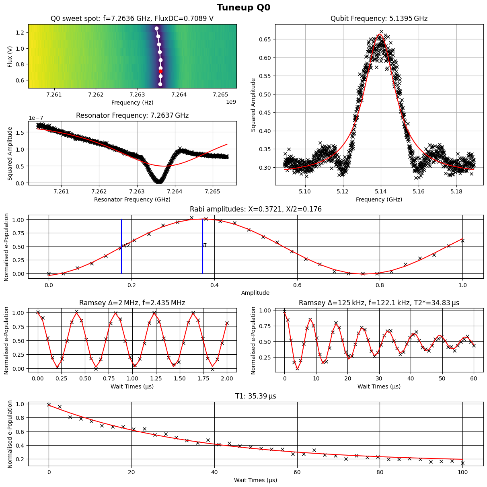

# Semi-automated single qubit tuneup with ZI
The `ExpZISingleQubitTuneup` class contains a [`run()` method for a standard tuneup](#standard-tuneup), and a [`run_fine_tuneup()` method for fine-tuning $X$ gates](#fine-tuneup).

## Standard tuneup
`ExpZISingleQubitTuneup.run()` is used for semi-automated tuneup of a transmon qubit. It contains routine measurements to find the flux sweet spot, calibrate Rabi pulses, fine-tune the qubit frequency, and characterise the qubit $T_1$ and $T_2^*$. The user should first identify the optimal frequencies of both the readout resonator (`ExpZIRes`) and the qubit (`ExpZIQubitSpec`), and the optimal readout power (`ExpZIResPowerSweep`). The user should also set `lab.HAL('Q0').ResetTime` to be at least 5 times greater than the expected $T_1$, and `lab.HAL('Q0').DriveGETime` to be reaonable. Once these attributes have been set to the qubit (e.g. `lab.HAL('Q0').ReadoutFrequency = 6.1e9`), `ExpZISingleQubitTuneup.run()` should take care of the rest. Averaging parameters (i.e. `lab.HAL('ZIacq').NumRepetitions = 1024`) should also be set by the user to allow for sufficient SNR.

### Example
An example code snippet of a tuneup call is given below.

```python
from sqdtoolz.Experiments.Experimental.ExpZISingleQubitTuneup import ExpZISingleQubitTuneup

lab.HAL('Q0').DriveGETime = 25e-9
lab.HAL('Q0').ResetTime = 500e-6 

lab.HAL('ZIacq').NumRepetitions = 1024
stz.ExperimentConfiguration('ZI', lab, 0, [], 'ZIacq')

exp = ExpZISingleQubitTuneup('Tuneup', lab.CONFIG('ZI'), lab.HAL('QPU'), 'Q0', flux_range=np.arange(1.25, 0.5, -0.1), qubit_spec_LO_power=-25, res_freq_span=5e6)
exp.run(lab)
```

### Description
Default parameters for `ExpZISingleQubitTuneup` have been set so that the existing qubit parameters are used to choose suitable frequency ranges for spectroscopy experiments, and drive/readout powers for time domain experiments (Rabi, Ramsey, lifetime etc.). However, the user has access to all measurement parameters as keyword arguments when initialising the `ExpZISingleQubitTuneup` class.

The measurement sequence and attributes set by each measurement in `ExpZISingleQubitTuneup` (as well as the corresponding optional input arguments) is as follows:
1. **Resonator flux sweep:** sweeps the flux according to `flux_range`, which is the only required argument for measurement parameters. If no `flux_range` is given, the resonator flux sweep is skipped. Sets `FluxDC` to the sweetspot.
    - `flux_range`: Array of voltages to sweep over in the resonator flux sweep, e.g. `flux_range=np.arange(1.25, 0.5, -0.1)`. Defaults to `None`.
    - `res_freq_range`:  Array of frequencies for resonator spectroscopy, e.g. `res_freq_range=np.linspace(7.2e9, 7.3e9, 1001)`. Defaults to an array of 1001 points, with a 10 MHz span around the `ReadoutFrequency` currently set to the qubit (i.e. `lab.HAL('Q0').ReadoutFrequency`).
    - `res_freq_span`: Float value to define the span (can only be provided as an alternative to `res_freq_range`). Defaults to `10e6`.
    - `res_freq_points`: Number of frequency points (can only be provided as an alternative to `res_freq_range`). Defaults to `1001`.
2. **Resonator spectroscopy:** Resonator spectroscopy sweep, sets `ReadoutFrequency`.
    - Depends on the same arguments as the resonator flux sweep (excluding `flux_range`).
3. **Qubit spectroscopy:** Qubit spectroscopy sweep, sets the qubit frequency at the sweetspot `DriveGE`.
    - `qubit_spec_LO_power`: Drive LO power in dBm. Defaults to `-20`.
    - `qubit_freq_range`: Array of frequencies for qubit spectroscopy, e.g. `qubit_freq_range=np.linspace(4.0e9, 4.5e9, 1001)`. Defaults to an array of 1001 points, with a 100 MHz span around the `DriveGE` currently set to the qubit (i.e. `lab.HAL('Q0').DriveGE`).
    - `qubit_freq_span`: Float value to define the span (can only be provided as an alternative to `qubit_freq_range`). Defaults to `100e6`.
    - `qubit_freq_points`: Number of frequency points (can only be provided as an alternative to `qubit_freq_range`). Defaults to `1001`.
4. **Amplitude Rabi:** Amplitude Rabi experiment with drive tone at frequency `lab.HAL('Q0').DriveGE`, and drive power set by `qubit_time_domain_LO_power`. Sets `DriveGEAmplitudeX` and `DriveGEAmplitudeXon2`.
    - `qubit_time_domain_LO_power`: Drive LO power in dBm for the amplitude Rabi measurement and all following time domain measurements. Defaults to `10`.
    - `rabi_amplitudes`: Array of amplitudes to sweep in the Rabi measurements. Defaults to `np.linspace(0, 1, 30)`.
    - `rabi_points`: Number of amplitude points to sweep between 0 and 1 (can only be provided as an alternative to `rabi_amplitudes`). Defaults to `30`. 
5. **Fast Ramsey:** A fast Ramsey experiment (2 MHz detuning, 2 us timespan) to lock onto qubit frequency. Sets `DriveGE`.
    - `ramsey_fast_detuning`: Detuning for the fast Ramsey experiment. Defaults to `2e6`. 
    - `ramsey_fast_times`: Array of time points for fast Ramsey experiment. Defaults to `np.linspace(0, 2e-6, 40)`.
    - `ramsey_fast_max`: Maximum timepoint for fast Ramsey experiment (can only be provided as an alternative to `ramsey_fast_times`). Defaults to `2e-6`.
    - `ramsey_fast_points`: Number of points in fast Ramsey experiment(can only be provided as an alternative to `ramsey_fast_times`). Defaults to `40`.
6. **Slow Ramsey:** A slow Ramsey experiment (125 kHz detuning, 60 us timespan) to determine $T_2^*$ and further fine-tune qubit frequency. Sets `DriveGE` and `T2GE_star`.
    - `ramsey_slow_detuning`: Detuning for the slow Ramsey experiment. Defaults to `0.125e6`. 
    - `ramsey_slow_times`: Array of time points for slow Ramsey experiment. Defaults to `np.linspace(0, 60e-6, 60)`.
    - `ramsey_slow_max`: Maximum timepoint for slow Ramsey experiment (can only be provided as an alternative to `ramsey_slow_times`). Defaults to `60e-6`.
    - `ramsey_slow_points`: Number of points in slow Ramsey experiment(can only be provided as an alternative to `ramsey_slow_times`). Defaults to `60`.
7. **Lifetime measurement:** $T_1$ experiment to characterise the qubit's relaxation rate. Sets `T1GE`.
    - `t1_times`: Array of time points for lifetime experiment. Defaults to `np.linspace(0, 100e-6, 40)`.
    - `t1_max`: Maximum timepoint for lifetime experiment (can only be provided as an alternative to `t1_times`). Defaults to `100e-6`.
    - `t1_points`: MNumber of timepoints for lifetime experiment (can only be provided as an alternative to `t1_times`). Defaults to `40`.

The tuneup takes 2-3 minutes for default parameters and 1024 averages. After the tuneup is completed an aggregate plot containing all measurement results is produced and saved to the measurement directory (which is a grouped experiment). 
 
Below is an example of the output plots.


## Fine tuneup

`ExpZISingleQubitTuneup.run_fine_tuneup` performs a follow-up sequence of finer calibrations intended to be run after `run` has already established a good working point for the qubit (readout/qubit frequency, Rabi amplitudes, $T_1$/$T_2^*$). It refines the qubit frequency, optimises the DRAG pulse, and calibrates the $X$ and $X/2$ gate amplitudes/phases. It is invoked with `exp.run_fine_tuneup(lab)`, using the same `ExpZISingleQubitTuneup` instance (and therefore the same keyword arguments) as `run`.

### Example

```python
from sqdtoolz.Experiments.Experimental.ExpZISingleQubitTuneup import ExpZISingleQubitTuneup

exp = ExpZISingleQubitTuneup('FineTuneupTest', lab.CONFIG('ZI'), lab.HAL('QPU'), 
        'Q3', num_gates_calibX_short=101, only_every_n_short=10, max_calibX_iterations=5)
exp.run_fine_tuneup(lab)
```
> **Note:** `run_fine_tuneup` relies on `self._q_scalings`, `self._ramsey_fine_*`, `self._num_gates_calibX_short`, `self._only_every_n_short`, `self._reverse_parity_calibX`, `self._threshold_X`, and `self._threshold_Xon2`, all of which are parsed from `**kwargs` in `__init__` — the same instance used for `run` can be reused for `run_fine_tuneup` without re-specifying shared parameters (e.g. readout/qubit frequency ranges), since only the fine-tuneup-specific keyword arguments above are consumed by this method. Note also that `max_calibX_iterations` and `assert_gate_calibration` are read with `kwargs.get(...)` (not `.pop(...)`) directly from `self._kwargs` inside `run_fine_tuneup` itself, rather than being parsed in `__init__` — so they remain visible in `self._kwargs` alongside any truly-unconsumed keyword arguments.

### Description

The measurement sequence and attributes set by each measurement in `run_fine_tuneup` (as well as the corresponding optional input arguments) is as follows:

1. **Fine Ramsey:** A slower, finer Ramsey experiment (125 kHz detuning by default, 60 us timespan by default) used to further lock in the qubit frequency and re-measure $T_2^*$. Sets `DriveGE` and `T2GE_star`.
    - `ramsey_fine_detuning`: Detuning for the fine Ramsey experiment. Defaults to `0.125e6`.
    - `ramsey_fine_times`: Array of time points for the fine Ramsey experiment. Defaults to `np.linspace(0, 60e-6, 120)`.
    - `ramsey_fine_max`: Maximum timepoint for the fine Ramsey experiment (can only be provided as an alternative to `ramsey_fine_times`). Defaults to `60e-6`.
    - `ramsey_fine_points`: Number of points in the fine Ramsey experiment (can only be provided as an alternative to `ramsey_fine_times`). Defaults to `120`.
    - `ramsey_assume_detuned_above`: Passed through to `exp.update_qubits(assume_detuned_above=...)` to resolve the sign ambiguity of the fitted detuning. Defaults to `True`.
2. **DRAG optimisation** *(skipped if `calibrate_drag=False`)*: Switches the qubit's drive pulse (`DriveGEPulse['function']`) to `'drag'` (if not already) and sweeps the DRAG $Q$-scaling parameter over a coarse range to locate the optimal value, then re-runs with a finer $\pm0.01$ window centred on that coarse optimum (at a higher repetition count) to refine it. Sets `DriveGEPulse['beta']`. The pulse viewer panel compares the previous and newly-calibrated DRAG pulses.
    - `calibrate_drag`: If `False`, skips the DRAG optimisation step entirely, leaving the existing `DriveGEPulse['beta']` unchanged. Defaults to `True`.
    - `drag_q_scalings`: Array of $Q$-scaling values to sweep in the coarse pass. Defaults to `np.linspace(0.00, 0.10, 15)`.
    - `num_repetitions_fine`: Number of repetitions (`NumRepetitions`) used for the fine DRAG pass; the acquisition's repetition count is temporarily set to this value then restored afterwards. Defaults to `1024*4` (i.e. `4096`).
3. **X calibration:** An iterative `ExpZICalibX` loop (rather than a single short/long pair) used to precisely calibrate the $X$ gate amplitude and resolve its parity. Each iteration runs a short, `only_every_n_short`-gate sequence; if the fitted rotation angle is within `X_gate_threshold` of $180°$, the loop exits early. If an iteration is worse than the previous one, the qubit amplitude is reverted to the best-so-far value and the parity guess is flipped before retrying. Otherwise the improvement is accepted, the qubit's `DriveGEAmplitudeX` is updated (clamped to a maximum of `1`), and the loop continues. Sets `DriveGEAmplitudeX`.
    - `num_gates_calibX_short`: Number of gate repetitions per iteration. Defaults to `201`.
    - `only_every_n_short`: The `only_every_n` parameter passed to `ExpZICalibX` (only every $n$-th gate-count point in the sequence is sampled). Defaults to `15`.
    - `max_calibX_iterations`: Maximum number of iterations before giving up (with a printed warning) and reverting to the best amplitude found. Defaults to `10`.
    - `reverse_parity_calibX`: Initial parity assumption used when updating the qubit amplitude; the loop flips it on alternating iterations and whenever an iteration regresses. Defaults to `False`.
    - `X_gate_threshold`: Convergence threshold, in degrees of deviation from $180°$, at which the loop exits early. Read with `kwargs.get(...)` rather than `.pop(...)`, so it also remains visible in `self._kwargs`. Defaults to `0.01`.
    - `assert_gate_calibration`: If `True`, raises an `AssertionError` after this step if the best angle found is not within `X_gate_threshold` of $180°$. Defaults to `False`.
4. **X/2 calibration:** The same iterative `ExpZICalibX` loop as the X calibration step, reusing `num_gates_calibX_short`, `only_every_n_short`, `max_calibX_iterations`, and `reverse_parity_calibX`, but calibrated against a $90°$ target rotation instead of $180°$ (`calib_denominator=2`). Sets `DriveGEAmplitudeXon2` (clamped to a maximum of `1`).
    - `Xon2_gate_threshold`: Convergence threshold, in degrees of deviation from $90°$, at which the loop exits early. Read with `kwargs.get(...)` rather than `.pop(...)`. Defaults to `0.01`.
    - **Note:** unlike the X calibration step, the equivalent `assert_gate_calibration` check for this step is currently commented out in the source, so `assert_gate_calibration` has no effect on the X/2 calibration outcome — it only asserts against the X gate's angle.

As with `run`, all steps are wrapped in a grouped experiment — opened via `lab.group_open(self._name)`, i.e. the *same* group name passed to the constructor, not a separate `'{name}_fine'` name as might be assumed if `run` and `run_fine_tuneup` were called under two different group scopes. An aggregate figure of all fine tuneup results is saved to the measurement directory as `FinetuneOverview.png`. This method is used in the [daily tuneup](ZI_DailyTuneup.md) routine.